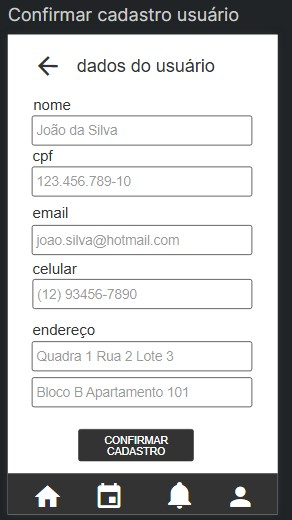
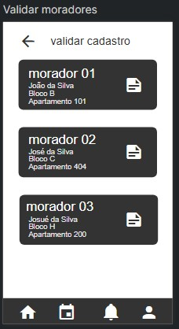
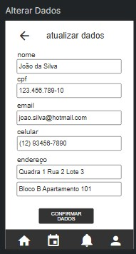
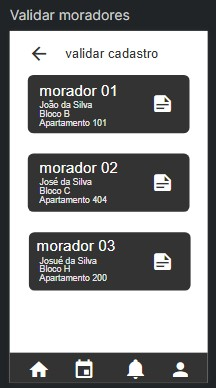
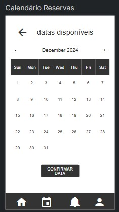
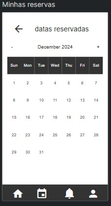

# 🌟 Programação de Computadores 3 (JavaScript) - Instituto Federal de Brasília 🌟

    
    
    

## 👨‍🏫 Professor
- **Leandro Vaguetti**

## 👨‍🎓 Alunos
- **[Arthur Ferreira](https://github.com/Necronomicatto)**
- **[David Caldas](https://github.com/caldasdv)**
- **[Tales Oliveira](https://github.com/TalesLimaOliveira)**

## 📚 Descrição
Repositório com o projeto desenvolvido na disciplina de **Programação de Computadores**, com foco na linguagem **JavaScript**. Este projeto tem como objetivo o desenvolvimento de uma **API Backend** para atender às demandas de um protótipo de aplicação elaborado em sala de aula. 🚀

### 🔍 Tópicos abordados:
- Estruturação e manipulação de **APIs RESTful** 🌐  
- Operações de **CRUD** (Create, Read, Update, Delete) com JavaScript 🗃️  
- Integração com **bancos de dados** MongoDB 🛢️

---

## Sistema de Gestão de Condomínio
Este é um sistema completo para a gestão de um condomínio, que permite realizar o cadastro de usuários, unidades, reservas, controle financeiro, ocorrências, encomendas, avisos, entre outras funcionalidades. Ele possui uma API RESTful desenvolvida com Node.js e MongoDB, permitindo fácil integração e gerenciamento do condomínio

### 🔗 Protótipo do projeto: [Quant UX](https://app.quant-ux.com/#/test.html?h=a2aa10az2iLb0Ao2DrTWqsqFPggbOKzNwgCywsL4tRuj9wFvpRajsRkwyQ3y&ln=en)

---

### ⚙️ Funcionalidades
- **Cadastro e Gerenciamento de Usuários**: Permite adicionar, editar, excluir e listar os usuários do sistema.
- **Gerenciamento de Unidades**: Cadastro, edição e listagem de unidades residenciais ou comerciais no condomínio.
- **Reservas**: Sistema para realizar e controlar as reservas de áreas comuns, como piscina, salão de festas, estacionamento, etc.
- **Controle Financeiro**: Gerenciamento das contas do condomínio, incluindo contas pendentes e pagas.
- **Ocorrências e Reclamações**: Permite registrar e consultar ocorrências de moradores e visitantes.
- **Taxas Extras**: Cadastro de taxas extras para cobranças adicionais.
- **Encomendas**: Sistema para registrar e controlar as encomendas recebidas no condomínio.
- **Avisos e Comunicados**: Cadastro e listagem de avisos importantes e comunicados para moradores e administradores.
- **Controle de Visitantes**: Registro de visitantes que acessam o condomínio.

---

### 💻 Tecnologias Usadas
- **Node.js**: Para o desenvolvimento da API backend.
- **Express**: Framework web para Node.js, utilizado para estruturar as rotas e controlar o fluxo de requisições.
- **MongoDB**: Banco de dados NoSQL utilizado para armazenar as informações do sistema.
- **Mongoose**: Biblioteca para modelagem de dados MongoDB em Node.js.

---

### 📂 Estrutura do Projeto

| **Diretório/Arquivo** | **Descrição**                             |
|-------------------|-----------------------------------------------|
| ├`controllers/`   | Lógica de controle das rotas.                 |
| ├`models/`        | Modelo de dados para usuários.                |
| ├`routers/`       | Rotas da aplicação.                           |
| ├`index.js`       | Ponto de entrada da aplicação.                | 
| ├`docs/`          | Imagens para exemplos de uso.                 |
| ├`package.json`   | Configurações do projeto e dependências.      |
| └`README.md`      | Documentação do projeto (este arquivo).       |

---

### 🚀 Como Executar  

1. **Instale os pacotes necessários:**  
> npm install

2. **Inicie a aplicação:**  
> npm start

---

### 📋 Rotas da API

#### 🧑 Usuários:

- `POST /api/user`: Adiciona um novo usuário.
- `GET /api/user`: Lista todos os usuários.
- `GET /api/user/buscaemail`: Busca usuário por email.
- `DELETE /api/user/:id` Deleta um usuário por ID.
- `PUT /api/user/:id`: Atualiza um usuário por ID.

#### 🏠 Unidades:

- `POST /api/unidade`: Adiciona uma nova unidade.
- `GET /api/unidade`: Lista todas as unidades.
- `GET /api/unidade/:id`: Busca unidade por ID.
- `DELETE /api/unidade/:id`: Deleta uma unidade por ID.
- `PUT /api/unidade/:id`: Atualiza uma unidade por ID.

#### 🎉 Reservas:

- `POST /api/reserva`: Adiciona uma nova reserva.
- `GET /api/reserva`: Lista todas as reservas.
- `GET /api/reserva/:id`: Busca reserva por ID.
- `DELETE /api/reserva/:id`: Deleta uma reserva por ID.
- `PUT /api/reserva/:id`: Atualiza uma reserva por ID.

#### 💸 Financeiro:

- `POST /api/financeiro`: Adiciona uma nova movimentação financeira.
- `GET /api/financeiro`: Lista todas as movimentações financeiras.
- `GET /api/financeiro/:id`: Busca movimentação financeira por ID.
- `DELETE /api/financeiro/:id`: Deleta uma movimentação financeira por ID.
- `PUT /api/financeiro/:id`: Atualiza uma movimentação financeira por ID.

#### 📦 Ocorrências:

- `POST /api/ocorrencia`: Adiciona uma nova ocorrência.
- `GET /api/ocorrencia`: Lista todas as ocorrências.
- `GET /api/ocorrencia/:id`: Busca ocorrência por ID.
- `DELETE /api/ocorrencia/:id`: Deleta uma ocorrência por ID.
- `PUT /api/ocorrencia/:id`: Atualiza uma ocorrência por ID.

#### 📝 Reclamações:

- `POST /api/reclamacao`: Cria uma nova reclamação.
- `GET /api/reclamacao`: Lista todas as reclamações.
- `GET /api/reclamacao/:id`: Busca uma reclamação por ID.
- `PUT /api/reclamacao/:id`: Atualiza uma reclamação existente.
- `DELETE /api/reclamacao/:id`: Deleta uma reclamação.

#### 📢 Avisos:

- `POST /api/aviso`: Cria um novo aviso.
- `GET /api/aviso`: Lista todos os avisos.
- `GET /api/aviso/:id`: Busca um aviso por ID.
- `PUT /api/aviso/:id`: Atualiza um aviso existente.
- `DELETE /api/aviso/:id`: Deleta um aviso.

#### 📄 Documentos:

- `POST /api/documento`: Cria um novo documento ou comunicado.
- `GET /api/documento`: Lista todos os documentos e comunicados.
- `GET /api/documento/:id`: Busca um documento ou comunicado por ID.
- `PUT /api/documento/:id`: Atualiza um documento ou comunicado.
- `DELETE /api/documento/:id`: Deleta um documento ou comunicado.

#### 📦 Encomendas:

- `POST /api/encomenda`: Cria uma nova encomenda.
- `GET /api/encomenda`: Lista todas as encomendas.
- `GET /api/encomenda/:id`: Busca encomenda por ID.
- `PUT /api/encomenda/:id`: Atualiza uma encomenda existente.
- `DELETE /api/encomenda/:id`: Deleta uma encomenda.

#### 🏢 Blocos:

- `POST /api/bloco`: Cria um novo bloco.
- `GET /api/bloco`: Lista todos os blocos.
- `PUT /api/bloco/:id`: Atualiza as informações de um bloco.
- `DELETE /api/bloco/:id`: Deleta um bloco.

---

### 📌 Exemplos de Uso
- O servidor estará rodando na porta 3001. Acesse `http://localhost:3001` para ver a mensagem de boas-vindas.

- Use um cliente HTTP (como Postman) para interagir com a API através das rotas definidas em `src/routers/routes.js`.

#### Adicionar um Usuário

- **Rota**: `POST /user`
- **Descrição**: Adiciona um novo usuário ao sistema.
- **Entrada**:
  - `nome` (string): Nome do usuário.
  - `email` (string): Email do usuário.
  - `password` (string): Senha do usuário.
- **Exemplo de Requisição**:
    > curl -X POST http://localhost:3001/user -H "Content-Type: application/json" -d '{"nome": "João da Silva", "email": "joao.silva@hotmail.com", "password": "12345678"}'

- **Saída**:
  - `id` (string): ID do usuário.
  - `nome` (string): Nome do usuário.
  - `email` (string): Email do usuário.
- **Tela do Protótipo**:
  - A tela de cadastro de usuário utiliza esta rota para adicionar novos usuários.
  

#### Listar Todos os Usuários

- **Rota**: `GET /user`
- **Descrição**: Lista todos os usuários cadastrados no sistema.
- **Entrada**: Nenhuma.
- **Exemplo de Requisição**:
    > curl http://localhost:3001/user
- **Saída**:
  - `users` (array): Lista de usuários.
    - `id` (string): ID do usuário.
    - `nome` (string): Nome do usuário.
    - `email` (string): Email do usuário.
- **Tela do Protótipo**:
  - A tela de listagem de usuários utiliza esta rota para exibir todos os usuários cadastrados.
  

#### Atualizar um Usuário

- **Rota**: `PUT /user/:id`
- **Descrição**: Atualiza as informações de um usuário existente.
- **Entrada**:
  - `nome` (string): Nome do usuário.
  - `email` (string): Email do usuário.
  - `password` (string): Senha do usuário.
- **Exemplo de Requisição**:
    > curl -X PUT http://localhost:3001/user/1 -H "Content-Type: application/json" -d '{"nome": "João da Silva", "email": "joao.silva@hotmail.com", "password": "87654321"}'
- **Saída**:
  - `id` (string): ID do usuário.
  - `nome` (string): Nome do usuário.
  - `email` (string): Email do usuário.
- **Tela do Protótipo**:
  - A tela de edição de usuário utiliza esta rota para atualizar as informações de um usuário existente.
  

#### Deletar um Usuário

- **Rota**: `DELETE /user/:id`
- **Descrição**: Deleta um usuário do sistema.
- **Entrada**: Nenhuma.
- **Exemplo de Requisição**:
    > curl -X DELETE http://localhost:3001/user/1
- **Saída**:
  - Mensagem de confirmação da exclusão.
- **Tela do Protótipo**:
  - A tela de listagem de usuários utiliza esta rota para deletar um usuário.
  

#### Adicionar uma Unidade

- **Rota**: `POST /unidade`
- **Descrição**: Adiciona uma nova unidade ao sistema.
- **Entrada**:
  - `numero` (string): Número da unidade.
  - `tipo` (string): Tipo da unidade (residencial ou comum).
  - `bloco` (string): ID do bloco.
  - `proprietario` (string): Nome do proprietário (se aplicável).
  - `moradores` (array): Lista de moradores (se aplicável).
  - `descricao` (string): Descrição da unidade.
- **Exemplo de Requisição**:
    > curl -X POST http://localhost:3001/unidade -H "Content-Type: application/json" -d '{"numero": "101", "tipo": "residencial", "bloco": "12345", "proprietario": "João da Silva", "moradores": ["Maria da Silva"], "descricao": "Apartamento com vista para o parque"}'
- **Saída**:
  - `id` (string): ID da unidade.
  - `numero` (string): Número da unidade.
  - `tipo` (string): Tipo da unidade.
  - `bloco` (string): ID do bloco.
  - `proprietario` (string): Nome do proprietário.
  - `moradores` (array): Lista de moradores.
  - `descricao` (string): Descrição da unidade.
- **Tela do Protótipo**:
  - A tela de cadastro de unidade utiliza esta rota para adicionar novas unidades.
  

#### Listar Todas as Unidades

- **Rota**: `GET /unidade`
- **Descrição**: Lista todas as unidades cadastradas no sistema.
- **Entrada**: Nenhuma.
- **Exemplo de Requisição**:
    > curl http://localhost:3001/unidade
- **Saída**:
  - `unidades` (array): Lista de unidades.
    - `id` (string): ID da unidade.
    - `numero` (string): Número da unidade.
    - `tipo` (string): Tipo da unidade.
    - `bloco` (string): ID do bloco.
    - `proprietario` (string): Nome do proprietário.
    - `moradores` (array): Lista de moradores.
    - `descricao` (string): Descrição da unidade.
- **Tela do Protótipo**:
  - A tela de listagem de unidades utiliza esta rota para exibir todas as unidades cadastradas.
  

#### Atualizar uma Unidade

- **Rota**: `PUT /unidade/:id`
- **Descrição**: Atualiza as informações de uma unidade existente.
- **Entrada**:
  - `numero` (string): Número da unidade.
  - `tipo` (string): Tipo da unidade.
  - `bloco` (string): ID do bloco.
  - `proprietario` (string): Nome do proprietário.
  - `moradores` (array): Lista de moradores.
  - `descricao` (string): Descrição da unidade.
- **Exemplo de Requisição**:
    > curl -X PUT http://localhost:3001/unidade/1 -H "Content-Type: application/json" -d '{"numero": "101", "tipo": "residencial", "bloco": "12345", "proprietario": "João da Silva", "moradores": ["Maria da Silva"], "descricao": "Apartamento com vista para o parque"}'
- **Saída**:
  - `id` (string): ID da unidade.
  - `numero` (string): Número da unidade.
  - `tipo` (string): Tipo da unidade.
  - `bloco` (string): ID do bloco.
  - `proprietario` (string): Nome do proprietário.
  - `moradores` (array): Lista de moradores.
  - `descricao` (string): Descrição da unidade.
- **Tela do Protótipo**:
  - A tela de edição de unidade utiliza esta rota para atualizar as informações de uma unidade existente.
  

#### Deletar uma Unidade

- **Rota**: `DELETE /unidade/:id`
- **Descrição**: Deleta uma unidade do sistema.
- **Entrada**: Nenhuma.
- **Exemplo de Requisição**:
    > curl -X DELETE http://localhost:3001/unidade/1
- **Saída**:
  - Mensagem de confirmação da exclusão.
- **Tela do Protótipo**:
  - A tela de listagem de unidades utiliza esta rota para deletar uma unidade.
  

#### Adicionar uma Reserva

- **Rota**: `POST /reserva`
- **Descrição**: Adiciona uma nova reserva ao sistema.
- **Entrada**:
  - `unidade` (string): ID da unidade.
  - `data_reserva` (date): Data da reserva.
  - `periodo_inicio` (date): Início do período da reserva.
  - `periodo_fim` (date): Fim do período da reserva.
  - `descricao` (string): Descrição da reserva.
- **Exemplo de Requisição**:
    > curl -X POST http://localhost:3001/reserva -H "Content-Type: application/json" -d '{"unidade": "12345", "data_reserva": "2023-10-01", "periodo_inicio": "2023-10-01T10:00:00Z", "periodo_fim": "2023-10-01T12:00:00Z", "descricao": "Reserva do salão de festas"}'
- **Saída**:
  - `id` (string): ID da reserva.
  - `unidade` (string): ID da unidade.
  - `data_reserva` (date): Data da reserva.
  - `periodo_inicio` (date): Início do período da reserva.
  - `periodo_fim` (date): Fim do período da reserva.
  - `descricao` (string): Descrição da reserva.
- **Tela do Protótipo**:
  - A tela de cadastro de reserva utiliza esta rota para adicionar novas reservas.
  

#### Listar Todas as Reservas

- **Rota**: `GET /reserva`
- **Descrição**: Lista todas as reservas cadastradas no sistema.
- **Entrada**: Nenhuma.
- **Exemplo de Requisição**:
    > curl http://localhost:3001/reserva
- **Saída**:
  - `reservas` (array): Lista de reservas.
    - `id` (string): ID da reserva.
    - `unidade` (string): ID da unidade.
    - `data_reserva` (date): Data da reserva.
    - `periodo_inicio` (date): Início do período da reserva.
    - `periodo_fim` (date): Fim do período da reserva.
    - `descricao` (string): Descrição da reserva.
- **Tela do Protótipo**:
  - A tela de listagem de reservas utiliza esta rota para exibir todas as reservas cadastradas.
  

#### Atualizar uma Reserva

- **Rota**: `PUT /reserva/:id`
- **Descrição**: Atualiza as informações de uma reserva existente.
- **Entrada**:
  - `unidade` (string): ID da unidade.
  - `data_reserva` (date): Data da reserva.
  - `periodo_inicio` (date): Início do período da reserva.
  - `periodo_fim` (date): Fim do período da reserva.
  - `descricao` (string): Descrição da reserva.
- **Exemplo de Requisição**:
    > curl -X PUT http://localhost:3001/reserva/1 -H "Content-Type: application/json" -d '{"unidade": "12345", "data_reserva": "2023-10-01", "periodo_inicio": "2023-10-01T10:00:00Z", "periodo_fim": "2023-10-01T12:00:00Z", "descricao": "Reserva do salão de festas"}'
- **Saída**:
  - `id` (string): ID da reserva.
  - `unidade` (string): ID da unidade.
  - `data_reserva` (date): Data da reserva.
  - `periodo_inicio` (date): Início do período da reserva.
  - `periodo_fim` (date): Fim do período da reserva.
  - `descricao` (string): Descrição da reserva.
- **Tela do Protótipo**:
  - A tela de edição de reserva utiliza esta rota para atualizar as informações de uma reserva existente.
  

#### Deletar uma Reserva

- **Rota**: `DELETE /reserva/:id`
- **Descrição**: Deleta uma reserva do sistema.
- **Entrada**: Nenhuma.
- **Exemplo de Requisição**:
    > curl -X DELETE http://localhost:3001/reserva/1
- **Saída**:
  - Mensagem de confirmação da exclusão.
- **Tela do Protótipo**:
  - A tela de listagem de reservas utiliza esta rota para deletar uma reserva.
  

#### Adicionar uma Movimentação Financeira

- **Rota**: `POST /financeiro`
- **Descrição**: Adiciona uma nova movimentação financeira ao sistema.
- **Entrada**:
  - `tipo` (string): Tipo da movimentação (receita ou despesa).
  - `descricao` (string): Descrição da movimentação.
  - `valor` (number): Valor da movimentação.
  - `data` (date): Data da movimentação.
  - `categoria` (string): Categoria da movimentação (conta, reserva, taxa_extra).
  - `unidade` (string): ID da unidade (se aplicável).
  - `taxa_extra` (string): ID da taxa extra (se aplicável).
  - `reserva` (string): ID da reserva (se aplicável).
  - `conta` (string): ID da conta (se aplicável).
- **Exemplo de Requisição**:
    > curl -X POST http://localhost:3001/financeiro -H "Content-Type: application/json" -d '{"tipo": "receita", "descricao": "Pagamento de condomínio", "valor": 500, "data": "2023-10-01", "categoria": "conta", "conta": "12345"}'
- **Saída**:
  - `id` (string): ID da movimentação.
  - `tipo` (string): Tipo da movimentação.
  - `descricao` (string): Descrição da movimentação.
  - `valor` (number): Valor da movimentação.
  - `data` (date): Data da movimentação.
  - `categoria` (string): Categoria da movimentação.
  - `unidade` (string): ID da unidade.
  - `taxa_extra` (string): ID da taxa extra.
  - `reserva` (string): ID da reserva.
  - `conta` (string): ID da conta.
- **Tela do Protótipo**:
  - A tela de cadastro de movimentação financeira utiliza esta rota para adicionar novas movimentações.
  

#### Listar Todas as Movimentações Financeiras

- **Rota**: `GET /financeiro`
- **Descrição**: Lista todas as movimentações financeiras cadastradas no sistema.
- **Entrada**: Nenhuma.
- **Exemplo de Requisição**:
    > curl http://localhost:3001/financeiro
- **Saída**:
  - `movimentacoes` (array): Lista de movimentações financeiras.
    - `id` (string): ID da movimentação.
    - `tipo` (string): Tipo da movimentação.
    - `descricao` (string): Descrição da movimentação.
    - `valor` (number): Valor da movimentação.
    - `data` (date): Data da movimentação.
    - `categoria` (string): Categoria da movimentação.
    - `unidade` (string): ID da unidade.
    - `taxa_extra` (string): ID da taxa extra.
    - `reserva` (string): ID da reserva.
    - `conta` (string): ID da conta.
- **Tela do Protótipo**:
  - A tela de listagem de movimentações financeiras utiliza esta rota para exibir todas as movimentações cadastradas.
  

#### Atualizar uma Movimentação Financeira

- **Rota**: `PUT /financeiro/:id`
- **Descrição**: Atualiza as informações de uma movimentação financeira existente.
- **Entrada**:
  - `tipo` (string): Tipo da movimentação.
  - `descricao` (string): Descrição da movimentação.
  - `valor` (number): Valor da movimentação.
  - `data` (date): Data da movimentação.
  - `categoria` (string): Categoria da movimentação.
  - `unidade` (string): ID da unidade.
  - `taxa_extra` (string): ID da taxa extra.
  - `reserva` (string): ID da reserva.
  - `conta` (string): ID da conta.
- **Exemplo de Requisição**:
    > curl -X PUT http://localhost:3001/financeiro/1 -H "Content-Type: application/json" -d '{"tipo": "receita", "descricao": "Pagamento de condomínio", "valor": 500, "data": "2023-10-01", "categoria": "conta", "conta": "12345"}'
